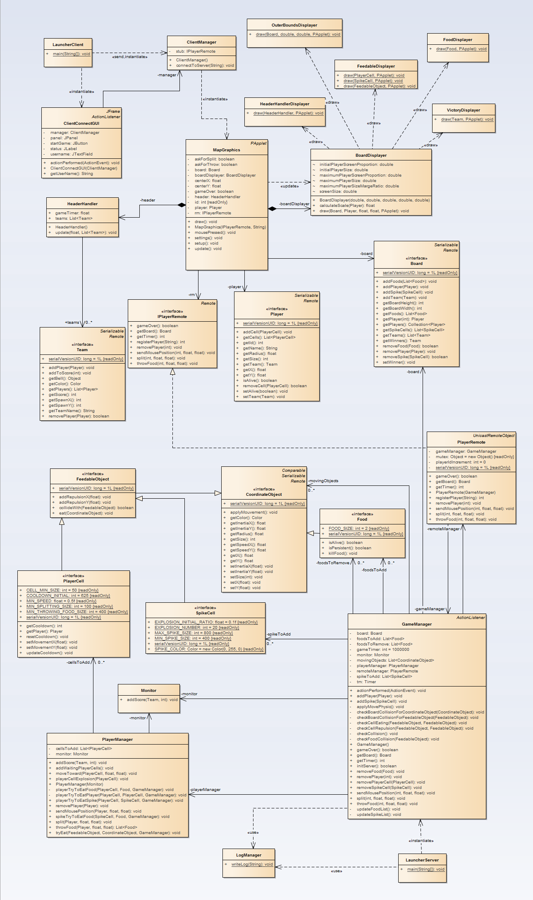

### This is a simple game to apply RMI, concurrency and AspectJ

- RMI
- AspectJ
- Monitor

### Model
This model does not show the implementation of the interfaces, to have more details please go to [Interfaces](src/server/model/)

### Intructions
- Run the server
- Run as many clients that connects to the server
